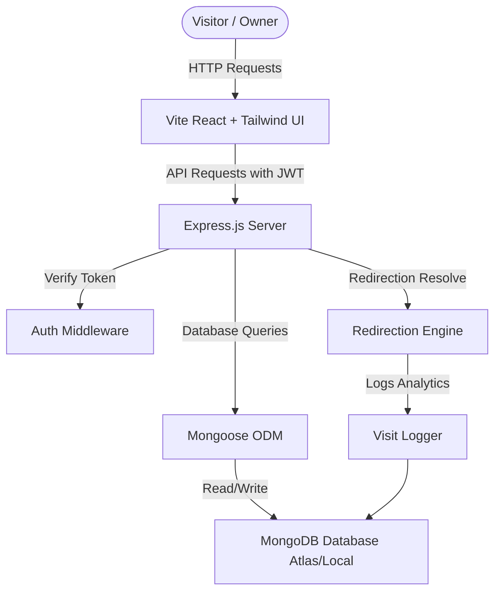

# ChronoLink AI – Premium URL Shortener & Analytics Platform

ChronoLink AI is an enterprise-grade URL shortener and real-time analytics engine featuring a gorgeous dark-themed glassmorphism interface with neon glow accents, micro-animations, interactive dashboard reports, and CSV bulk import capabilities.

---

## 1. Project Planning

ChronoLink AI was built in modular phases following modern software development practices:
- **Phase 1: Architecture & Modeling**: Defined Mongoose schemas for Users, Links, and individual click Visits.
- **Phase 2: Core RESTful Services**: Developed an Express backend with custom middlewares (JWT authentication protection, Optional JWT extraction for public endpoints, client user-agent parsing).
- **Phase 3: Visual Identity**: Structured the React + Vite frontend using Tailwind CSS v4 styling rules, establishing CSS-level variables for the dark neon glass aesthetic.
- **Phase 4: Component Assembly**: Built Auth forms, stats cards, searchable paginated link lists, QR modals, and CSV parsing wrappers.
- **Phase 5: Real-Time Analytics**: Integrated Recharts Area and Pie charts to report visitor trends, browser brands, device hardware types, and countries/cities regions.
- **Phase 6: Advanced Security**: Integrated an automated "Forgot Password" feature utilizing secure code generation and verification, ensuring robust account recovery without breaking existing auth pipelines.

---

## 2. Feature Documentation

### Core Features
- **User Authentication**: Secure Sign-up, Sign-in, and Logout flows powered by JWT (JSON Web Tokens) stored locally and password encryption via bcrypt.
- **Account Recovery**: A robust 3-step "Forgot Password" workflow generating 6-digit secure pins, fully isolated from core login endpoints to prevent vulnerability.
- **URL Shortener & Redirection**: Validates URL schemas before generating unique 6-character short codes. Performs high-speed server-side 302 redirects while logging visitor information.
- **Interactive Link Dashboard**: Track total created links, overall click events, and active URLs on cards. Search, filter, sort, and paginate through your links.
- **Visual Analytics Dashboard**: Displays click histories, trend reports (Area Chart), browser clients (Progress bars), device segments (Pie Chart), and geographic top-ranking regions (countries and cities).

### Premium Bonus Features
- **Custom Alias**: Replace random short codes with custom text (e.g., `/myportfolio`).
- **Expiry Dates**: Select optional timeline limits. Expired links smoothly redirect visitors to a warning page.
- **QR Code Generation**: Generate vector QR codes for short links with instant download options.
- **Destination URL Editing**: Modify target destinations on active short links without breaking the short code.
- **Bulk CSV Upload**: Drag and drop spreadsheets to generate hundreds of links concurrently, capturing successes and failures in real-time.
- **Public Statistics Toggle**: Choose to share specific link analytics pages with external clients by switching on a public stats routing link (`/stats/:id`).

---

## 3. Architecture Diagram



---

## 4. Database Schema

### User Model
```javascript
{
  name: { type: String, required: true },
  email: { type: String, required: true, unique: true },
  password: { type: String, required: true }, // Hashed using bcrypt
  resetPasswordCode: { type: String }, // Hashed 6-digit code
  resetPasswordExpiry: { type: Date }, // 10-minute expiry window
  createdAt: { type: Date, default: Date.now }
}
```

### URL Model
```javascript
{
  userId: { type: ObjectId, ref: 'User', required: true },
  originalUrl: { type: String, required: true },
  shortCode: { type: String, required: true, unique: true },
  customAlias: { type: String, unique: true, sparse: true },
  expiryDate: { type: Date, default: null },
  totalClicks: { type: Number, default: 0 },
  lastVisited: { type: Date, default: null },
  isPublicStats: { type: Boolean, default: false },
  createdAt: { type: Date, default: Date.now }
}
```

### Visit Model
```javascript
{
  urlId: { type: ObjectId, ref: 'Url', required: true },
  timestamp: { type: Date, default: Date.now },
  browser: { type: String, default: 'Unknown' },
  device: { type: String, default: 'Unknown' },
  country: { type: String, default: 'Unknown' },
  city: { type: String, default: 'Unknown' }
}
```

---

## 5. Setup Instructions

### Prerequisites
- Node.js installed (v16+ recommended).
- Local MongoDB running, or a MongoDB Atlas account.

### Backend Setup
1. Navigate to the backend directory:
   ```bash
   cd backend
   ```
2. Install dependencies:
   ```bash
   npm install
   ```
3. Create a `.env` file in `/backend` (or edit the existing one):
   ```env
   PORT=5000
   MONGODB_URI=mongodb+srv://admin:<db_password>@cluster0.mongodb.net/chronolink?retryWrites=true&w=majority
   JWT_SECRET=your_super_secret_jwt_key
   FRONTEND_URL=http://localhost:5173
   ```
4. Start the backend:
   ```bash
   npm start
   ```

### Frontend Setup
1. Navigate to the frontend directory:
   ```bash
   cd ../frontend
   ```
2. Install dependencies:
   ```bash
   npm install
   ```
3. Start Vite dev server:
   ```bash
   npm run dev
   ```
4. Open your browser to `http://localhost:5173/`.

---

## 6. Deployment Instructions

### Backend Deployment (Heroku/Render)
1. Commit backend files to Git.
2. Set configuration variables in the hosting provider dashboard (`MONGODB_URI`, `JWT_SECRET`, `FRONTEND_URL`).
3. Deploy the backend.

### Frontend Deployment (Vercel/Netlify)
1. Run local build to verify compilation correctness:
   ```bash
   npm run build
   ```
2. Set environment variables to point to the production backend URL inside the API request wrapper.
3. Link project to Vercel/Netlify and deploy.

---

## 7. API Documentation

### Authentication Routes
- `POST /api/auth/register`: Create a new user account.
- `POST /api/auth/login`: Authenticate credentials and return JWT token.
- `POST /api/auth/forgot-password`: Generates a secure recovery pin.
- `POST /api/auth/reset-password`: Verifies the recovery pin and updates user password.

### Link Management Routes
- `POST /api/urls`: Create a shortened link. Supports custom aliases and expiration dates.
- `GET /api/urls`: Lists all shortened links. Supports search queries, sorting, and pagination.
- `PUT /api/urls/:id`: Modifies target destination URL, expiration timelines, or public statistics visibility toggle.
- `DELETE /api/urls/:id`: Removes the short code and cleans up corresponding visit analytics log tables.
- `POST /api/urls/bulk`: Shorten multiple URLs concurrently by uploading a CSV spreadsheet.

### Analytics Routes
- `GET /api/analytics/:id`: Aggregates total click counters, browser divisions, device viewports, geographic areas, and click trend dates.

### Redirection Routes
- `GET /:shortCode`: Server-side redirection handler. Logs details (User-Agent parsing) and routes users to the target URL.

---

## 8. Assumptions Made
- Loopback addresses (`127.0.0.1` and `::1`) bypass geo-location databases. Therefore, during local testing, visitor geolocation coordinates are mock-simulated with high-quality global locations so that dashboards populate graphs beautifully.
- Memory storage is utilized for CSV uploads, meaning file buffers are processed immediately on memory heaps and no files write to local disks, saving performance and maintaining security.
- Forgot Password emails are safely routed to terminal stdout during development/hackathon environments to prevent dependency on third-party SMTP servers.

---

## 9. Loom/YouTube Demo Placeholder
[](https://www.youtube.com/watch?v=dQw4w9WgXcQ)
*(Replace link with your actual recorded hackathon presentation video URL)*

---

This project is a part of a hackathon run by https://katomaran.com
